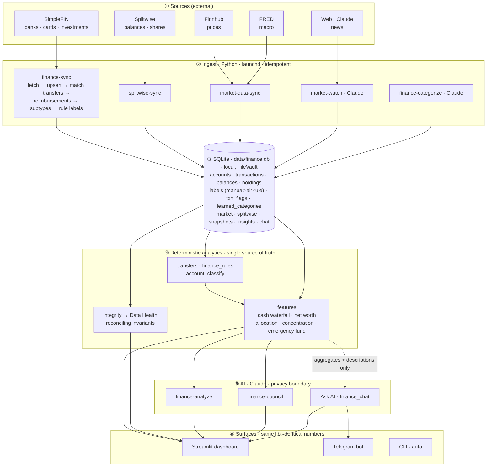

# my-automations

A personal automation platform. Each automation is a self-contained folder with a
manifest; it runs on a schedule (launchd), on demand (CLI / dashboard / Telegram),
or as a Claude Code skill. The platform is general — **Finance is the first and
deepest domain**: a local-first **personal financial-intelligence system**.

See [PRD.md](PRD.md) for the full design and [CLAUDE.md](CLAUDE.md) for conventions.

---

## 💰 My Financial Intelligence

Aggregates your banks, cards, investments, shared expenses, and markets into a
**local-first**, **cash-honest**, **self-reconciling** picture of your money — with
a deterministic analytics core and a Claude layer for analysis and Q&A.

**Principles**
- **Local-first & private.** All data and compute live on-device (SQLite, FileVault).
  Only *anonymized aggregates* (and, for the chat/categorizer, transaction
  *descriptions*) ever leave the machine — to Claude. Never account numbers.
- **Cash-honest.** Metrics track real money in/out. No phantom income is inferred;
  401(k), one-time refunds/bonuses, and savings-transfers are reported *separately*
  so they never masquerade as recurring cash.
- **Self-reconciling.** Invariants are enforced and surfaced (Data Health), so
  "totalling errors" show up instead of hiding inside an aggregate.
- **Deterministic core.** Classification, dedup, and all totals are plain Python —
  the LLM never decides a number. You tag; your judgment sticks.

### Architecture

📐 **[Full module reference → `docs/MODULES.md`](docs/MODULES.md)**  ·  editable diagram:
[`docs/financial-intelligence-system.excalidraw`](docs/financial-intelligence-system.excalidraw)
([open at excalidraw.com](https://excalidraw.com)) · [SVG render](docs/financial-intelligence-system.svg)



### End-to-end data flow

1. **Ingest** — `finance-sync` pulls SimpleFIN in 45-day chunks (banks cap history
   ~90 days), upserts accounts/transactions/balances/holdings idempotently, then in
   one pass: **matches internal transfers** (debit↔credit by amount/date — card-bill
   payments become `Payment`), **detects P2P reimbursements** (inbound Zelle/Venmo
   "from a person", excluded from transfer-matching), **classifies subtypes**
   (HYSA via behavioural APY + product list; brokerage/retirement/equity), and
   **applies rule labels**. `splitwise-sync`, `market-data-sync`, and `market-watch`
   load their domains; `finance-categorize` asks Claude to label only what's left
   as `Other`.
2. **Store** — everything lands in one local SQLite DB. Category precedence is
   **manual > ai > rule**; manual edits learn a merchant→category rule and persist.
3. **Deterministic analytics** — `features.build()` reads the DB and computes every
   metric in plain Python (the LLM never produces a number): the cash-flow waterfall,
   net worth, allocation, concentration, emergency fund. `integrity` runs the
   reconciling invariants for the **Data Health** page.
4. **AI layer** — `finance-analyze`/`finance-council` get *only anonymized
   aggregates*; `Ask AI` (and the categorizer) additionally see transaction
   *descriptions*. Account numbers never cross this boundary. The chat agent returns
   a JSON contract (`answer` + chart specs the UI renders deterministically).
5. **Surfaces** — the dashboard, Telegram bot, and CLI all read the same lib, so the
   numbers are identical everywhere; chat history is shared between phone and dashboard.

### The accuracy / cash model (don't regress)

| Concept | How it's computed |
|---|---|
| **Income** | Payroll/stipend only. Other inflows are *not* assumed income. |
| **Spend** | Consumption only. Excludes `NON_SPEND` = Transfer, **Payment** (card bills), Investment, Credit, Income. Card *purchases* are the spend, counted once. |
| **Reimbursements** | Inbound P2P (Zelle/Venmo) "from a person" is netted against outbound P2P — a pass-through is a wash; a genuine repayment for fronted spend lifts surplus. |
| **Operating cash surplus** | take-home − spending + net reimbursements (the real recurring cash kept). 401(k) / one-time inflows / savings-transfers shown separately. |
| **Typical month** | Median/run-rate over *complete* calendar months (current + partial-start dropped). `one_time`-tagged txns excluded from the run-rate but kept in actuals. |
| **Net worth** | Σ effective account values (investments use holdings value) − debts + **Splitwise receivable**. Stale/feed-dropped holdings excluded. |
| **Account subtypes** | Auto-classified: HYSA (behavioural APY + product) vs savings; brokerage / retirement / equity-awards. |

### Data Health (reconciliation invariants)

The **🩺 Data Health** page / `lib/py/integrity.py` checks, every load:
`net worth == assets − debts (+ receivable)` · `total assets ≥ net worth` ·
no duplicate transactions · deterministic duplicate-charge detection
(same account + merchant + amount, ≤2 days) · stale/phantom holdings ·
stale feeds · balance↔transaction reconciliation. It **flags** for review and
never auto-deletes — you confirm via transaction tags.

### Transaction tags (your judgment, persisted)

On the Spending page each row can be tagged (survives re-syncs):
- **one-time** — kept in actuals & net worth, removed from typical-month figures
  (family flights, moving costs).
- **exclude** — dropped from all analytics (a confirmed duplicate/error).

### Surfaces

- **Dashboard** (`auto ui`, binds `127.0.0.1`): Overview (reconciling cash-flow
  waterfall, net worth, allocation), Spending (editable categories + tags),
  Accounts (by institution, subtypes), Investments (holdings, gain/loss,
  concentration), Market (your holdings vs benchmarks, news), **Ask AI** (chat +
  auto-charts + history), **Data Health**, AI Analysis, Council.
- **Telegram bot**: type a question (no command needed) → answer + chart image +
  follow-up buttons; inline action menu; history shared with the dashboard.
- **CLI**: `auto run/status/ui/logs/...`.

### Finance automations

| id | what it does | schedule |
|---|---|---|
| `finance-sync` | SimpleFIN ETL → SQLite; internal-transfer & reimbursement detection; subtypes; rule labels | daily 06:00 |
| `splitwise-sync` | Splitwise balances + your expense share | daily 06:30 |
| `finance-categorize` | Claude labels only `Other`/`Uncategorized` | daily 06:45 |
| `market-data-sync` | Finnhub prices + FRED macro | weekdays 17:00 |
| `market-watch` | Claude scouts market-moving news → sourced brief | weekdays 08:00, 16:00 |
| `finance-summary` | point-in-time snapshot → Telegram | daily 07:30 |
| `finance-weekly` | last-7-days spend/balance digest → Telegram | Mon 08:00 |
| `finance-analyze` | Claude multi-lens investing analysis (aggregates only) | monthly |
| `finance-council` | 8-investor debate + fiduciary mediator | on demand |
| `telegram-bot` | always-on dispatcher (service) | KeepAlive |

---

## Setup

```bash
python3 -m venv .venv && source .venv/bin/activate
pip install -r requirements.txt
pip install pre-commit && pre-commit install     # secret scanner (recommended)
```

Install the `auto` command (run from anywhere):

```bash
ln -sf "$(pwd)/bin/auto" ~/.local/bin/auto        # ~/.local/bin must be on PATH
```
`python cli/auto <cmd>` and `auto <cmd>` are equivalent.

## Usage

```bash
auto list [--category C]      # list automations, grouped by category
auto status [--category C]    # service state (running/stopped) + last run
auto run <id>                 # run one now (resolves secrets, logs it)
auto start|stop|restart <id|category|all>   # manage launchd services
auto logs <id> [--lines N]    # tail logs
auto ui                       # dashboard on 127.0.0.1:8501 (single instance)
auto skills                   # (re)generate /<id> Claude Code skills
auto update [--category C]    # pull + regenerate skills + restart running services
```

`auto start <id|category|all>` installs a macOS launchd job (scheduled jobs use
local time and run missed jobs on wake; `service` automations run as KeepAlive
daemons).

## Secrets

Manifests declare secret **names** only; values live in the macOS Keychain under
service `my-automations` (never committed):

```bash
security add-generic-password -s my-automations -a SIMPLEFIN_ACCESS_URL -w
security add-generic-password -s my-automations -a SPLITWISE_API_KEY -w
security add-generic-password -s my-automations -a TELEGRAM_TOKEN -w
security add-generic-password -s my-automations -a TELEGRAM_CHAT_ID -w
security add-generic-password -s my-automations -a CLAUDE_CODE_OAUTH_TOKEN -w
security add-generic-password -s my-automations -a FINNHUB_API_KEY -w
security add-generic-password -s my-automations -a FRED_API_KEY -w
# (omit -w's value to be prompted — keeps it out of shell history)
```

SimpleFIN one-time setup (claim a Bridge **setup token** → Access URL):

```bash
python lib/py/finance_cli.py setup-simplefin    # paste token (hidden); stored to Keychain
```

See PRD §11 for the full security model.

## Layout

```
automations/<category>/<id>/   automation.yaml + entry point   (e.g. automations/finance/finance-sync/)
lib/py/                        shared + finance libs (store, features, integrity, finance_chat, finance_viz, …)
cli/auto                       runner + service manager
ui/app.py                      Streamlit dashboard
docs/                          architecture diagram (.excalidraw)
```

Finance is the first category; new domains are new folders under
`automations/<domain>/`. The Telegram bot namespaces commands per domain
(`/finance …`, plus global `/run`, `/status`, `/help`).
